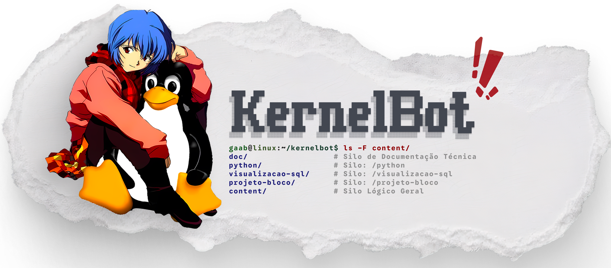
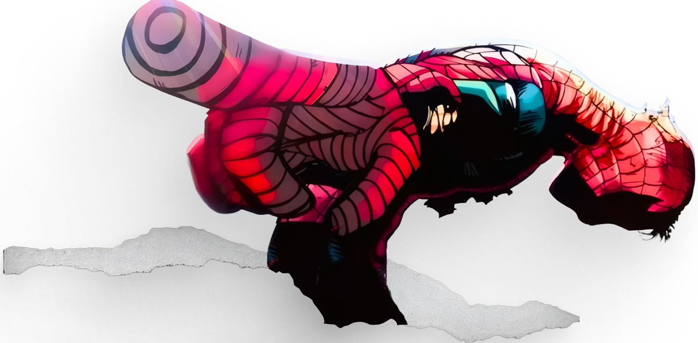

  

 

  
  
  <strong><h3>Em obras (ou quase isso)</h3></strong>
  
  
O código já está performando mais que muito sênior por aí, mas a documentação ainda está sendo "indexada" pela minha produtividade.

  
  

    <strong>Se você é um recrutador:</strong> O código fala mais que mil palavras. Olhe a pasta <code>engine/</code>. 
    <strong>Se você é um curioso:</strong> Volte em breve. Ou dê um <code>python main.py</code> e descubra.

  
   

