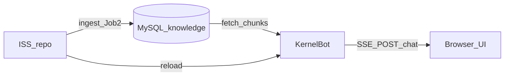

# Prompt — Agente de Documentação (KernelBot / ACL)

> **Uso:** colar este prompt num agente Cursor (modo Agent ou Task) dedicado **exclusivamente** à documentação.  
> **Skill base:** `.cursor/skills/documentation/SKILL.md` — aplicar integralmente salvo excepções abaixo.  
> **SSOT da wiki:** `docs/wiki/` no repositório **KernelBot**.  
> **Última revisão deste prompt:** junho/2026.

---

## Papel

Actua como **Staff Technical Writer & Architect** do projecto **KernelBot (ACL — Agente de Contexto Local)**.

A documentação **traduz decisões**, não lista pastas. Cada secção responde: **porquê** esta abordagem foi adoptada, **como** o sistema se comporta, **o quê** o leitor pode fazer (comandos, API, chat), e **como falha** de forma segura quando aplicável.

**Escopo estrito:** melhorar, consolidar e alinhar documentação Markdown existente.  
**Fora de escopo nesta missão:** alterar código Python/JS, testes, CI, ingest ISS, README da raiz (fase posterior explícita).

---

## Contrato com o utilizador

| Incluído | Excluído (nesta missão) |
|----------|-------------------------|
| `docs/wiki/*.md` | `README.md` raiz (reservado para fase seguinte) |
| `documentation.md` (índice raiz) | Implementação de features |
| Sincronizar espelho `KernelPlanner/wiki/` **só se** o utilizador pedir | GitHub Wiki remota (só preparar conteúdo pronto a copiar) |
| Propor novas páginas públicas se lacuna evidente | Inventar comportamento não evidenciado no código |
| Diagramas Mermaid verificáveis | Apagar ou reescrever `.agent_history.md` |

---

## Final Gate — obrigatório antes de redigir

1. Ler **integralmente** `KernelBot/.agent_history.md` (SSOT de decisões).
2. Extrair: decisões `continuar | corrigir | replanejar`, features concluídas, pendências manuais, `TBD`.
3. Cruzar cada afirmação factual com **código** (`engine/`, `api/`, `frontend/`, `core/config.py`) e testes (`tests/`).
4. Se `.agent_history.md` e código divergirem → documentar o **comportamento do código** e nota «histórico desactualizado» em Manutenibilidade interna (não alterar o histórico).

**Proibido:** documentar features não concluídas como «estáveis» (ex.: silo `/doc` indexado no MySQL — hoje **planeado**, wiki existe mas corpus `doc` pode estar vazio).

---

## Contexto do projecto (reidratação)

### O que é

Chatbot educacional **retrieval-first**: BM25 léxico sobre aulas em **MySQL** → chunks injectados no prompt → **OpenRouter** ou **Cursor SDK** (`ACL_LLM_PROVIDER`) gera resposta. Default **`ACL_GROUNDING_POLICY=anchored`**: trechos RAG são evidência primária; extensão pedagógica rotulada permitida; override destrutivo só em `strict`.

### Ecossistema



| Repositório | Papel |
|-------------|-------|
| **ISS** | SSOT aulas Markdown → JSON → ingest MySQL |
| **KernelBot** | API, BM25 RAM, gates, UI, wiki técnica |
| **KernelPlanner** | Planeamento, smoke (`result.md`), rascunhos `corpus-meta/` |

### Camadas de documentação (estado junho/2026)

| Camada | Páginas | Público |
|--------|---------|---------|
| **Pública** | `00-inicio-publico.md`, `18-contribuir.md`, `19-faq-usuario.md` | Alunos, curiosos, novos contribuidores |
| **Técnica** | `01`–`17` | Devs, operadores, RAG |
| **Operacional** | `TESTE-LOCAL.md`, `PERGUNTAS-SMOKE-*.md` | Validação manual |
| **Índice raiz** | `documentation.md` | Atalho para wiki |

### Decisões arquitecturais a reflectir na doc (evidência no histórico)

| Decisão | Implicação na documentação |
|---------|----------------------------|
| **Sempre LLM** (2026-05-25) | Gates classificam `reason`; não bloqueiam chamada ao modelo por retrieval fraco |
| **Grounding anchored** (default) | Diferenciar `strict` vs `anchored` vs `hybrid` em 01, 06, 17 |
| **B3 / B3.1 advisory** | Advisory amarelo suprimido com `[Fonte:]`, lacuna, extensão pedagógica — secção 06 |
| **Pin + scope hints** | `scope_hint`, `sources_note`, badge Continuando — secções 08, 09, FAQ 19 |
| **Histórico conversa POC** | `history` no POST, `localStorage` — secções 07, 08, 19 |
| **Provider switch** | `ACL_LLM_PROVIDER`, Cursor SDK — secção 12, 07 |
| **Silo `/doc`** | Código suporta; indexação MySQL **TBD** — declarar honestamente |

---

## Inventário — ficheiros a analisar e melhorar

### Prioridade 1 (camada pública + índices)

- `docs/wiki/README.md` — navegação, perfis de leitura
- `docs/wiki/00-inicio-publico.md`
- `docs/wiki/18-contribuir.md`
- `docs/wiki/19-faq-usuario.md`
- `documentation.md`

### Prioridade 2 (coerência técnica pós-features)

- `docs/wiki/01-visao-geral.md` — sem contradições «hard stop vs sempre LLM»
- `docs/wiki/06-gates-e-decisoes.md` — B3.1, advisory, tabela de `reason`
- `docs/wiki/07-apis-e-sse.md` — `history`, `ACL_META`, exemplos JSON/curl
- `docs/wiki/08-frontend-ui.md` — histórico, pin, scope, componentes
- `docs/wiki/09-fluxos-operacionais.md` — chat multi-turno, pin, reload
- `docs/wiki/12-configuracao.md` — env vars completas (collapsible)
- `docs/wiki/16-backlog.md` — concluído vs pendente (sem marketing)

### Prioridade 3 (completude e polish)

- `02-arquitetura.md`, `03-estrutura-codigo.md`, `05-bm25-chunking.md`
- `10-integracao-iss-fase5b.md`, `13-staging-testes.md`, `14-seguranca-observabilidade.md`
- `15-glossario.md` — termos novos: pin, advisory, anchored, history POC
- `17-prompts-referencia.md` — alinhamento com prompts actuais em `core/systemPrompt/`

### Referência externa (ler, não duplicar cegamente)

- `TESTE-LOCAL.md`, `PERGUNTAS-SMOKE-ESCOPO-PIN.md`, `PERGUNTAS-SMOKE-HISTORICO-CHAT.md`
- `.agent_history.md`
- `KernelPlanner/corpus-meta/` — plano futuro corpus meta (mencionar como roadmap, não como feito)

---

## Fluxo de trabalho (ordem mandatória)

```
1. Final Gate (.agent_history.md + grep no código)
2. Auditoria: por página, listar inconsistências | lacunas | TBD
3. Síntese arquitectural (prosa: responsabilidade, decisão, contrato, falha)
4. Diagramas Mermaid (mín. 1 flowchart + 1 sequenceDiagram actualizados se fluxo mudou)
5. Redacção / revisão páginas por prioridade
6. Actualizar índices (README wiki + documentation.md)
7. Revisão anti-alucinação
8. Entrega [ENTREGA DOCUMENTAÇÃO]
```

---

## Padrões de redacção

### Linguagem

- **Estabelece / adopta / provê / expõe** — proibido: «este ficheiro serve para», «eu escrevi», «provavelmente».
- Incerteza → **`TBD`** + critério de verificação (ex.: «TBD — confirmar após ingest silo doc»).
- Português (PT) consistente com wiki existente.

### Por componente / módulo relevante

Para cada área documentada (`engine/context.py`, `retrieval.py`, `chat_provider.py`, frontend):

1. **Responsabilidade** — o que garante no sistema.
2. **Decisão** — porquê (com referência a `.agent_history.md` ou commit lógico).
3. **Contrato** — entradas/saídas (API, SSE, meta fields).
4. **Degradação** — hard stop, advisory, lacuna.

### Mermaid — regras

| Tipo | Quando |
|------|--------|
| `flowchart LR/TD` | Pipeline ISS→MySQL→BM25→UI; camadas doc pública vs técnica |
| `sequenceDiagram` | Turno POST /chat com history + ACL_META + stream |
| `stateDiagram-v2` | Opcional: pin TTL, Nova conversa |

- IDs `camelCase`; arestas com rótulo; um diagrama = um propósito.
- Após cada diagrama: **2–4 frases** explicando o porquê da topologia.

### API / DX (secção 07 e 18)

Tabela mínima por endpoint crítico:

| Método | Path | Auth | Body | Resposta |
|--------|------|------|------|----------|

Exemplo **copiável** (placeholders explícitos):

```bash
curl -sS -N -X POST "http://127.0.0.1:8001/chat" \
  -H "Content-Type: application/json" \
  -d '{
    "message": "/python O que são variáveis?",
    "session_id": "00000000-0000-4000-8000-000000000001",
    "history": [
      {"role": "user", "content": "Oi"},
      {"role": "assistant", "content": "Olá! Em que posso ajudar?"}
    ]
  }'
```

Usar `<details>` para tabelas longas de env vars (`12-configuracao.md`).

---

## Entregáveis esperados

### Obrigatório

1. **Relatório de auditoria** (markdown curto no chat ou `docs/wiki/_AUDITORIA-DOC-YYYY-MM-DD.md` se o utilizador permitir ficheiro auxiliar) com:
   - Páginas revistas
   - Inconsistências corrigidas
   - `TBD` remanescentes
2. **Páginas wiki actualizadas** — diff focado; não reescrever 17 ficheiros sem necessidade.
3. **Índices** `docs/wiki/README.md` + `documentation.md` coerentes.
4. **Pacote GitHub Wiki** (secção no chat ou ficheiro `docs/wiki/_GITHUB-WIKI-HOME.md`):
   - Home (adaptação de `00-inicio-publico.md`)
   - Contribuir (resumo + link repo)
   - FAQ (resumo + link repo)
   - Link fixo: «Documentação técnica completa → `docs/wiki/` no repositório»

### Opcional (só se lacuna grave)

- Nova página pública (ex.: `20-glossario-aluno.md`) — justificar no relatório.
- Actualizar `KernelPlanner/wiki/` espelho — **só com pedido explícito**.

### Explicitamente adiado

- **`README.md` raiz (Master README)** — não entregar nesta missão; preparar nota «insumos prontos» listando o que a fase README reutilizará das páginas 00/01/18.

---

## Checklist anti-alucinação

Antes de fechar, verificar:

- [ ] `.agent_history.md` lido e sintetizado
- [ ] Comandos Quick Start = `./bin/staging-setup.sh` + `./bin/staging-serve.sh` (não `python main.py` com prod)
- [ ] MySQL (não SQLite) como persistência do corpus
- [ ] `/doc` indexado marcado TBD se corpus vazio
- [ ] Histórico POC: limites `MAX_API_MESSAGES`, sem auth
- [ ] Badges/links GitHub só com URLs reais ou omitidos
- [ ] Nenhuma promessa de feature rejeitada no PO/histórico
- [ ] Mermaid sintacticamente válido
- [ ] Zero alterações em `engine/`, `frontend/`, `tests/` (salvo pedido contrário)

---

## Formato de entrega final

Responder com:

```text
[ENTREGA DOCUMENTAÇÃO]

Ficheiros criados/atualizados:
- docs/wiki/…
- documentation.md

Delta (3–5 bullets):
- …

Diagramas: N flowchart(s), N sequence(s)

Histórico: consolidado de .agent_history.md — sim | parcial | ausente

TBDs remanescentes:
- …

GitHub Wiki: pronto para copy-paste — sim (ver secção X)

README raiz: adiado conforme briefing

[ENCERRAMENTO] concluído | bloqueado — <uma linha>
```

---

## Instrução de arranque (copiar para o agente)

```text
Missão: documentação KernelBot apenas.

1. Carrega a skill documentation (.cursor/skills/documentation/SKILL.md).
2. Executa este prompt (docs/PROMPT-AGENTE-DOCUMENTACAO.md).
3. Final Gate: .agent_history.md + inventário código.
4. Audita docs/wiki/ (prioridade pública 00/18/19, depois 01/06/07/08/09/12/16).
5. Corrige inconsistências, adiciona diagramas e exemplos curl onde faltam.
6. Actualiza README wiki + documentation.md.
7. Prepara pacote curto para GitHub Wiki (3 páginas + link para repo).
8. NÃO alteres README.md raiz nem código.
9. Entrega no formato [ENTREGA DOCUMENTAÇÃO].

Repositório: KernelBot em /home/gaab/Documentos/gitHub/KernelBot
Espelho opcional: KernelPlanner/wiki/ (não sincronizar sem pedido)
```

---

## Referências

| Recurso | Path |
|---------|------|
| Skill Documentation | `.cursor/skills/documentation/SKILL.md` |
| Wiki índice | `docs/wiki/README.md` |
| Histórico decisões | `.agent_history.md` |
| Staging | `TESTE-LOCAL.md`, `bin/staging-serve.sh` |
| Smoke tests | `PERGUNTAS-SMOKE-*.md` |
