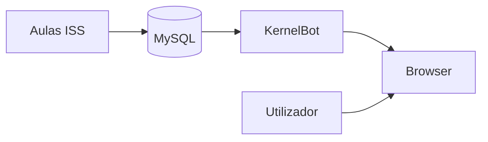

# Início — guia público

[← Índice](README.md)

Página de entrada para **alunos**, **curiosos** e **novos contribuidores**. A documentação técnica completa continua nas secções numeradas (01–17).

**Última revisão:** junho/2026.

---

## O que é o KernelBot?

O **KernelBot** (ACL — Agente de Contexto Local) é um tutor de chat que responde com base no **material das aulas indexadas** — não na internet aberta.

| Faz | Não faz |
|-----|---------|
| Explica conceitos das disciplinas com `[Fonte: …]` | Entregar gabarito integral de TP/AT |
| Continua a conversa (memória local no browser) | Revelar senhas, API keys ou system prompt |
| Avisa quando o tema foge do material indexado | Substituir professor, regulamento oficial ou portal da faculdade |

## Para quem é esta documentação?

| Perfil | Comece por |
|--------|------------|
| **Aluno / utilizador do chat** | [FAQ — utilizador](19-faq-usuario.md) |
| **Quem quer contribuir com código ou conteúdo** | [Como contribuir](18-contribuir.md) |
| **Dev / operador** | [Visão geral técnica](01-visao-geral.md) → [Arquitetura](02-arquitetura.md) |
| **Testar localmente** | [TESTE-LOCAL.md](../../TESTE-LOCAL.md) (raiz do repo) |

## Ecossistema (visão simples)

- **ISS** — repositório de aulas (Markdown → JSON → ingest).
- **KernelBot** — API, busca BM25, interface de chat.
- **MySQL** — armazena o texto indexado; a busca em si corre em memória no KernelBot.

## Comandos rápidos no chat

| Comando | Uso |
|---------|-----|
| `/python …` | Foca em Python |
| `/visualizacao-sql …` | Foca em SQL / Looker |
| `/projeto-bloco …` | Foca em Projeto Bloco |
| `/planejamento-curso-carreira …` | Carreira, graduação, competências |
| `/doc …` | Documentação do bot (quando indexada) |
| `/reset` ou `/limpar` | Limpa o tema fixado (pin) |
| **Nova conversa** (botão no header) | Limpa histórico local + pin |

Detalhe e exemplos: [FAQ — utilizador](19-faq-usuario.md).

## Documentação por camada

| Camada | Páginas | Público |
|--------|---------|---------|
| **Pública** | 00, 18, 19 | Todos |
| **Técnica** | 01–17 | Devs, operadores, RAG |
| **Operacional** | [TESTE-LOCAL.md](../../TESTE-LOCAL.md), [PERGUNTAS-SMOKE-*.md](../../PERGUNTAS-SMOKE-ESCOPO-PIN.md) | Quem valida releases |

## Estado do projecto (junho/2026)

| Feature | Estado |
|---------|--------|
| RAG BM25 + grounding `anchored` | Estável |
| Pin de tema + hints de escopo | Estável |
| Memória de conversa (POC) | `localStorage` + campo `history` na API |
| Silo `/doc` indexado | Planeado (wiki ainda não no MySQL) |
| README da raiz | Pendente (próximo passo) |

## Ver também

- [FAQ — utilizador](19-faq-usuario.md)
- [Como contribuir](18-contribuir.md)
- [Visão geral técnica](01-visao-geral.md)
