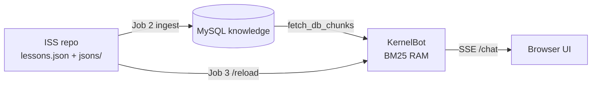

# Visão geral

[← Índice](README.md)

## O que é o ACL (KernelBot)

O **ACL — Agente de Contexto Local** é um chatbot educacional que combina:

1. **Recuperação léxica (BM25)** sobre aulas indexadas em MySQL.
2. **LLM** em (quase) todos os turnos — provider configurável (`ACL_LLM_PROVIDER`): **Cursor SDK** por default ou **OpenRouter**. O retrieval classifica a query e injecta chunks no prompt.
3. **Hard stop** apenas em falhas operacionais (ex.: `provider_error`) ou override em modo `strict` — não nos gates de retrieval.

Regra de ouro: o retrieval **orienta** fontes, `reason` e advisory pós-geração (`engine/retrieval.py`). Os trechos RAG são **evidência primária** do curso (default `grounding_anchored.txt`), não SSOT absoluto — extensão pedagógica rotulada é permitida; use `ACL_GROUNDING_POLICY=strict` para o modo conservador.

**Memória de conversa (POC):** o browser envia `history` opcional no `POST /chat`; persistência em `localStorage` (`acl_conversation_v1`). Ver [07-apis-e-sse.md](07-apis-e-sse.md) e [FAQ](19-faq-usuario.md).

> Linguagem não técnica: [Início — guia público](00-inicio-publico.md)

## Problema que o sistema resolve

| Necessidade | Como o ACL aborda |
|-------------|-------------------|
| Respostas ancoradas no material da faculdade | Chunks vindos de `knowledge.content` entram no prompt |
| Evitar alucinação em perguntas vagas | Gates de score, coverage, termos mínimos, ambiguidade |
| Sincronizar conteúdo do repositório ISS | Pipeline Fase 5b: ingest → MySQL → `/reload` |
| Melhorar recall sem relaxar segurança | Opção B2: metadados léxicos (keywords, concepts) no **chunk 0** do BM25 |

## O que o ACL **não** é

- Não é um chatbot com embeddings / busca semântica (apenas BM25 léxico).
- Não lê ficheiros em `KernelBot/content/` no fluxo actual (fonte é MySQL).
- Não faz auto-reload periódico do índice (`engine/watcher.py` é legado).
- Não versiona schema SQL neste repositório (tabela existe no ambiente MySQL).

## Princípios de design

| Princípio | Implicação |
|-----------|------------|
| **Anchored by default** | `ACL_GROUNDING_POLICY=anchored` — extensão pedagógica rotulada; override destrutivo só em `strict` |
| **Transporte ≠ indexação** | ISS grava **1 documento** por aula; KernelBot **fatiamento só em RAM** |
| **Metadados para BM25, não para o utilizador** | Bloco meta indexa termos; o aluno não precisa ver o bloco no chat |
| **Transição legada** | Aulas sem marcadores B2 continuam indexáveis (chunking legacy) |

## Limitações conhecidas (honestas)

| Limitação | Impacto |
|-----------|---------|
| BM25 léxico | Sinónimos e paráfrases falham se o termo não existir no chunk |
| Perguntas de 1 palavra | Gate `underspecified_query` (`MIN_TERMS=2`) |
| Índice só em RAM | Reinício do processo ou `/reload` necessários após ingest |
| `post_generation_advisory` | Aviso amarelo suave em `anchored`; suprimido quando há `[Fonte:]`, lacuna ou extensão pedagógica (B3.1) |
| Staging com 2 aulas | Fontes duplicadas em quase todas as queries — não representa produção |
| Histórico POC | Sem login — cliente pode forjar `history`; aceitável para demo local |

## Repositórios no ecossistema

| Repo | Papel |
|------|-------|
| **ISS** | SSOT de catálogo, Markdown, JSONs enriquecidos, workflow GHA |
| **KernelBot** | API, BM25, gates, UI, `/reload`, `/health/catalog` |

## Próximos passos de leitura

- Arquitectura: [02-arquitetura.md](02-arquitetura.md)
- Enriquecimento B2 (histórico completo): [11-enriquecimento-lexico-b2.md](11-enriquecimento-lexico-b2.md)
- Testar localmente: [13-staging-testes.md](13-staging-testes.md)
