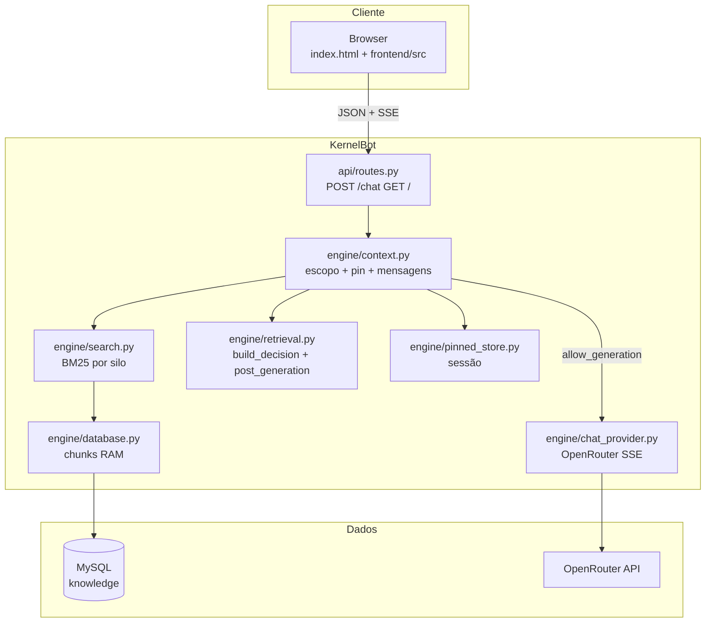

# Arquitetura

[← Índice](README.md)

## Stack tecnológica

| Camada | Tecnologia | Ficheiro(s) principal(is) |
|--------|------------|---------------------------|
| HTTP | FastAPI + Uvicorn | `main.py`, `app/factory.py`, `api/routes.py` |
| Retrieval | BM25Okapi (`rank-bm25`) | `engine/search.py` |
| Persistência | MySQL via PyMySQL | `engine/database.py` |
| LLM | OpenRouter (HTTP streaming) | `engine/chat_provider.py` |
| UI | HTML + JS (ES modules) | `templates/index.html`, `frontend/src/` |
| Protocolo cliente | SSE (`text/event-stream`) | `frontend/src/api.js` |
| Logs | stdlib + ACL structured | `core/logging_config.py`, `core/structured_log.py` |
| Config | python-dotenv | `core/config.py` |

## Diagrama de componentes (runtime)



## Camadas de decisão (ordem)

```text
1. Entrada validada (api/routes.py)
2. Escopo: comandos /doc, /python, pin, discipline JSON
3. BM25: SearchEngine.search_candidates() → raw_score
4. Gates: retrieval.build_decision() → allow_generation?
5. Se sim: montagem prompt + OpenRouter
6. Pós-geração: post_generation_flags() → override?
7. SSE: ACL_META + tokens + [DONE]
```

## `AppServices` (injeção de dependências)

Definido em `app/state.py`, montado em `main.py`:

| Campo | Função |
|-------|--------|
| `search_engine` | Índice BM25; `rebuild()` no boot e `/reload` |
| `context_manager` | Orquestra retrieval + decisão + pin |
| `chat_provider` | Streaming OpenRouter |
| `pinned_store` | Mapa `session_id` → chunks fixados |
| `lesson_catalog` | Catálogo ISS (opcional, `ACL_CATALOG_ENABLED`) |
| `indexed_lesson_keys` | Snapshot `discipline:slug` do MySQL |
| `catalog_drift_report` | Drift catálogo vs índice |

## Modos de contexto global

| Modo (`ACL_GLOBAL_CONTEXT`) | Comportamento |
|----------------------------|---------------|
| `geral` / `all` | BM25 em todos os silos; merge por score |
| Disciplina explícita | Filtro ao silo correspondente |
| Comandos no texto | `/doc`, `/content`, `/python`, etc. |

## Trade-offs arquitecturais

| Escolha | Benefício | Custo |
|---------|---------|-------|
| BM25 in-memory | Latência baixa, sem serviço vectorial | RAM cresce com catálogo; rebuild manual |
| Hard stop strict | Menos alucinação e menos tokens LLM | Mais recusas pedagógicas |
| Pin em memória | Follow-ups estáveis | Perde-se no restart; TTL por turnos |
| Documento unificado no MySQL | UPSERT simples, sem chunk_id | Chunking só no bot — duas camadas a documentar |

## Ver também

- [03-estrutura-codigo.md](03-estrutura-codigo.md)
- [05-bm25-chunking.md](05-bm25-chunking.md)
- [06-gates-e-decisoes.md](06-gates-e-decisoes.md)
