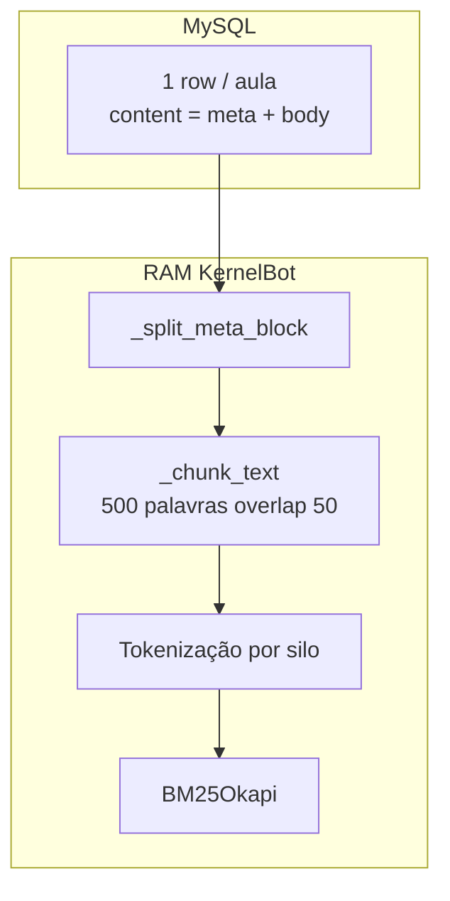

# BM25 e chunking (Opção B2)

[← Índice](README.md) · Ver também [11-enriquecimento-lexico-b2.md](11-enriquecimento-lexico-b2.md)

## Visão geral do pipeline de indexação



**Invariante:** o MySQL **não** armazena chunks — apenas o documento unificado.

## Constantes (`engine/database.py`)

| Constante | Valor | Significado |
|-----------|-------|-------------|
| `DB_CHUNK_WORDS` | 500 | Palavras por janela (só `clean_body`) |
| `DB_CHUNK_OVERLAP` | 50 | Overlap entre janelas |
| `MAX_CONTENT_CHARS` | 4_000_000 | Row ignorada no fetch se maior |

## Opção B2 — meta só no chunk 0

| `chunk_index` | Texto indexado |
|---------------|----------------|
| `0` | `Título: {title}\n` + bloco meta + primeiras ~500 palavras do body |
| `≥1` | `Título: {title}\n` + continuação do body (**sem** repetir meta) |

### Porquê B2 (e não meta em todos os chunks)

Com meta em **todos** os chunks, uma keyword presente no header (ex.: `transformers`) aparece em **N** documentos do mini-índice da mesma aula → **IDF → 0** → scores nulos → `insufficient_context`.

Com meta **só no chunk 0**, a keyword aparece **uma vez** por aula → IDF útil → chunk 0 ganha score.

| Query | B1 (meta em todos) | B2 (meta só chunk 0) |
|-------|-------------------|------------------------|
| `transformers` | 4 scores ≈ 0 | chunk0 > 0, outros 0 |
| Termo só no body (meio da aula) | — | chunk com termo no body ganha |

## Formato do bloco meta (indexado no chunk 0)

```text
[CONCEITOS E KEYWORDS DA AULA PARA INDEXAÇÃO LÉXICA]
Disciplina: …
Título: …
Conceitos: …
Keywords: …
Objetivos: …
====== FIM DOS METADADOS ======

{markdown body}
```

Marcadores partilhados com ISS (`ingest-knowledge.py`).

## Silos BM25 (`engine/search.py`)

- Cada `discipline` distinta no MySQL → um silo.
- `SearchEngine.rebuild()` constrói `BM25Okapi` por silo com lista tokenizada de cada chunk.
- `source` típico: `db:{discipline}/{slug}` (ex.: `db:fluencia-ia/introducao-fluencia-ia`).

### Busca

1. Tokeniza query (`re.findall(r"\w+", text.lower())`).
2. `bm25.get_scores(query_tokens)`.
3. Descarta `raw_score <= 0`.
4. Retorna top `candidate_k` com `matched_terms`.

## Rows legadas (sem bloco meta)

| Cenário | Comportamento |
|---------|---------------|
| Sem marcadores | `_split_meta_block` → `(None, text)`; chunks `{title}\n{body}` |
| Marcadores incompletos | ERROR `meta_block_malformed`; legacy sem meta |
| Parse error | ERROR `meta_block_parse_error`; legacy |

Boot e `/reload` **não** falham — aula continua indexável.

## Impacto no prompt LLM (`context.py`)

**Decisão actual (recomendação A):** meta **não** é re-injectado no prompt se só chunks ≥1 forem seleccionados.

| Cenário | Efeito |
|---------|--------|
| Query keyword | Tende a recuperar chunk 0 → LLM vê meta no trecho |
| Query sobre meio da aula | Pode recuperar chunk 2 sem meta no texto do prompt |

Backlog: injecção de meta uma vez por `source` no prompt — [16-backlog.md](16-backlog.md).

## Ver também

- [04-dados-e-mysql.md](04-dados-e-mysql.md)
- [06-gates-e-decisoes.md](06-gates-e-decisoes.md)
