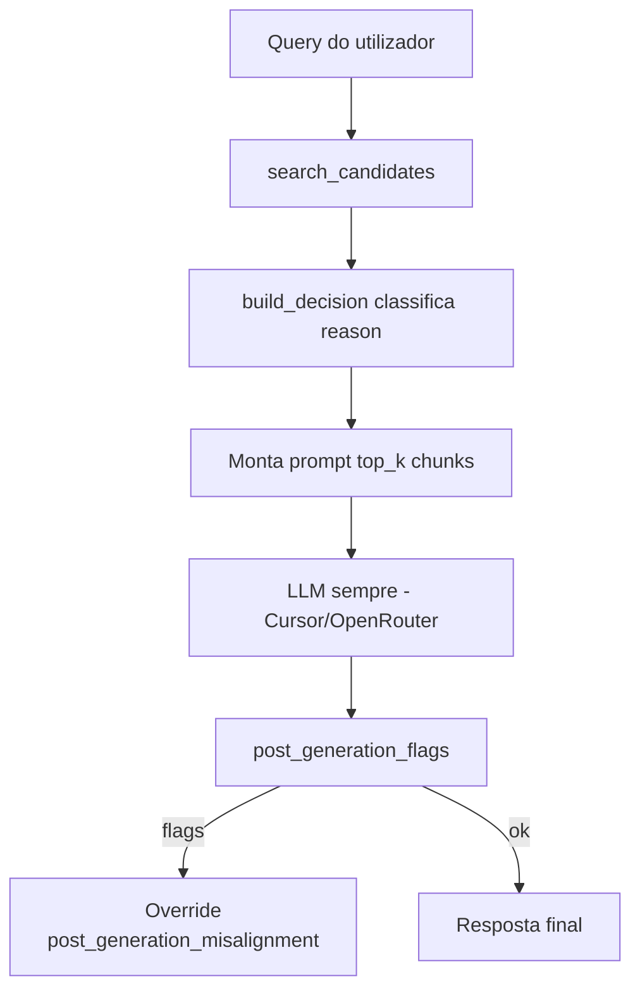

# Gates e decisões de retrieval

[← Índice](README.md)

## Filosofia

`engine/retrieval.py` **classifica** a query (`reason`, `confidence`) e selecciona chunks BM25 para o prompt. **Toda** mensagem dispara o LLM (provider configurável — Cursor SDK ou OpenRouter); `allow_generation` permanece `true` no contrato ACL_META (telemetria/UI).

A regra pedagógica “na dúvida, não responder” passa a **`grounding_strict.txt`** + disclaimers pós-geração — não a bloqueio de runtime.

## Fluxo de decisão



## Thresholds (defaults em código / `.env`)

| Parâmetro | Default | Variável `.env` | Efeito se falhar |
|-----------|---------|-----------------|------------------|
| Score mínimo top1 | 1.5 | `ACL_RETRIEVAL_MIN_SCORE` | `insufficient_context` |
| Margem 1º vs 2º | 0.15 | `ACL_RETRIEVAL_MIN_SCORE_MARGIN` | `ambiguous_retrieval` |
| Coverage | 0.34 | `ACL_RETRIEVAL_MIN_COVERAGE` | `context_misaligned` |
| Coverage ponderada | 0.34 | `ACL_RETRIEVAL_MIN_COVERAGE_WEIGHTED` | `context_misaligned` |
| Termos informativos mín. | 2 | `ACL_RETRIEVAL_MIN_TERMS` | `underspecified_query` |
| Candidatos BM25 | 8 | `ACL_RETRIEVAL_CANDIDATE_K` | — |
| Chunks no prompt | 4 | `ACL_RETRIEVAL_TOP_K` | — |
| Max chunks / fonte | 2 | `ACL_RETRIEVAL_MAX_CHUNKS_PER_SOURCE` | diversidade |

## `DecisionReason` — catálogo

| `reason` | Quando | LLM chamado? |
|----------|--------|--------------|
| `ok` | Passou todos os gates | **Sim** |
| `insufficient_context` | Sem hits ou `top_score < MIN_SCORE` | **Sim** (chunks fracos se existirem; vazio + strict se zero hits) |
| `underspecified_query` | Menos de `MIN_TERMS` termos informativos | **Sim** |
| `ambiguous_retrieval` | 2+ candidatos, margem < 0.15 | **Sim** (disambiguation só com `ACL_DISAMBIGUATION_ENABLED`) |
| `context_misaligned` | Coverage baixa no melhor chunk | **Sim** |
| `vague_but_high_risk` | Query estruturalmente vaga | **Sim** |
| `low_confidence` | Confiança agregada baixa | **Sim** |
| `index_gap` | Catálogo confiante mas chave fora do índice | **Sim** (advisory em `context.py`; RAG normal) |
| `post_generation_misalignment` | Sanity pós-LLM falhou | Sim + aviso |
| `provider_error` | Provider LLM falhou (Cursor/OpenRouter) | Não (texto fixo) |

## Mensagens legadas (`context.py`)

Templates em `HARD_STOP_MESSAGES` aplicam-se só a `trace.decision == "hard_stop"` (ex.: `provider_error`). Gates de retrieval **não** montam assistant pré-LLM.

Exemplo `underspecified_query`:

```text
Sua pergunta está vaga para responder com segurança usando a base.
Use o formato: [tecnologia] + [problema] + [contexto].
```

## Pós-geração: `post_generation_flags`

Executado em `chat_provider.py` após o LLM responder.

| Flag | Condição (resumo) |
|------|-------------------|
| `missing_informative_terms` | Resposta não contém termos informativos da query (`anchored`: só se `reason=ok`) |
| `missing_source_entities` | Não menciona fonte nem termos longos dos chunks (`anchored`/`hybrid`: omitido se há marcador de extensão pedagógica) |
| `introduced_unsupported_terms` | >25 (strict) ou >35 (anchored/hybrid) termos técnicos longos sem suporte nos chunks |

| `ACL_GROUNDING_POLICY` | Se há flags |
|------------------------|-------------|
| `strict` | Override destrutivo: `post_generation_misalignment` + disclaimer no stream |
| `anchored` / `hybrid` | **Advisory** apenas: `post_generation_advisory` + hint suave; resposta mantida |

### Supressão de advisory em `anchored` (B3.1)

Função `anchored_post_generation_advisory_flags()` em `engine/retrieval.py` — **não** emite advisory quando a resposta:

| Condição | Motivo |
|----------|--------|
| Contém `[Fonte:` | Citação explícita ao corpus |
| Declara lacuna ou recusa | Padrões `_LACUNA_OR_REFUSAL_RE` |
| Inclui extensão pedagógica rotulada | Marcador no texto do assistente |

Em `anchored`, `missing_informative_terms` não entra nas flags fortes; `introduced_unsupported_terms` só gera advisory se nenhuma das condições acima se aplicar.

### `sources_note` e pin (UI)

Quando o pin fixa um tema e a busca actual traz fontes **adicionais**, o meta inclui `sources_note` no rodapé — copy orienta `/reset` ou comando de disciplina. Não é advisory amarelo; é nota informativa (`engine/context.py` → `_build_scope_ui_hints`).

Texto de override (só `strict`):

```text
Preparei uma resposta com base nos trechos encontrados, mas a checagem final
indicou que ela pode ter saído do escopo das fontes.
```

### Porque isto aparece nos teus testes de staging

| Observação nos testes | Explicação |
|----------------------|------------|
| Resposta longa, bem fundamentada, Score 1.00 | Retrieval e LLM OK |
| Disclaimer no final | `missing_source_entities` ou `introduced_unsupported_terms` — resposta reformula com palavras novas |
| Índice só com 2 aulas | Heurística mais sensível; fontes `legacy` + `fluencia` em muitas queries |

**Não confundir** com falha do Opção B2 no BM25 — são camadas diferentes.

## Contratos de grounding condicionais

`engine/context.py` escolhe o bloco injectado via `_select_grounding()` conforme `ACL_GROUNDING_POLICY` (default **`anchored`**):

| Política | Comportamento |
|----------|----------------|
| `strict` | Sempre `grounding_strict.txt` (SSOT nos trechos) |
| `anchored` | Sempre `grounding_anchored.txt` (evidência primária + extensão pedagógica rotulada), excepto desambiguação |
| `hybrid` | `anchored` com chunks ou `reason=ok`; `permissive` sem chunks em retrieval fraco |

| `decision.reason` | Condição extra | Ficheiro | Chunks no prompt |
|-------------------|----------------|----------|------------------|
| `ambiguous_retrieval` | `ACL_DISAMBIGUATION_ENABLED=true` | `grounding_disambiguation.txt` | `[Fonte 1: …]`, `[Fonte 2: …]` |
| default (policy `anchored`) | — | `grounding_anchored.txt` | `[Fonte: path \| Score: …]` |
| default (policy `strict`) | — | `grounding_strict.txt` | `[Fonte: path \| Score: …]` |

`ACL_RETRIEVAL_MODE` está **deprecado**; `grounding_permissive.txt` usa-se em `hybrid` sem chunks.

## Ordem dos gates em `build_decision()` (simplificado)

1. Sem candidatos ou top score baixo → `insufficient_context` (+ chunks fracos se houver)
2. Poucos termos informativos → `underspecified_query`
3. Margem entre top2 → `ambiguous_retrieval`
4. Coverage / weighted coverage → `context_misaligned`
5. Vague but high risk → `vague_but_high_risk`
6. Caso contrário → `ok`

## Calibração

Os defaults são **conservadores** por design. Ajuste via `.env` após bateria de casos reais — documentar mudanças no [Backlog](16-backlog.md).

## Ver também

- [07-apis-e-sse.md](07-apis-e-sse.md) — `ACL_META` no SSE
- [08-frontend-ui.md](08-frontend-ui.md) — UI por `reason`
- [13-staging-testes.md](13-staging-testes.md) — perguntas de teste
