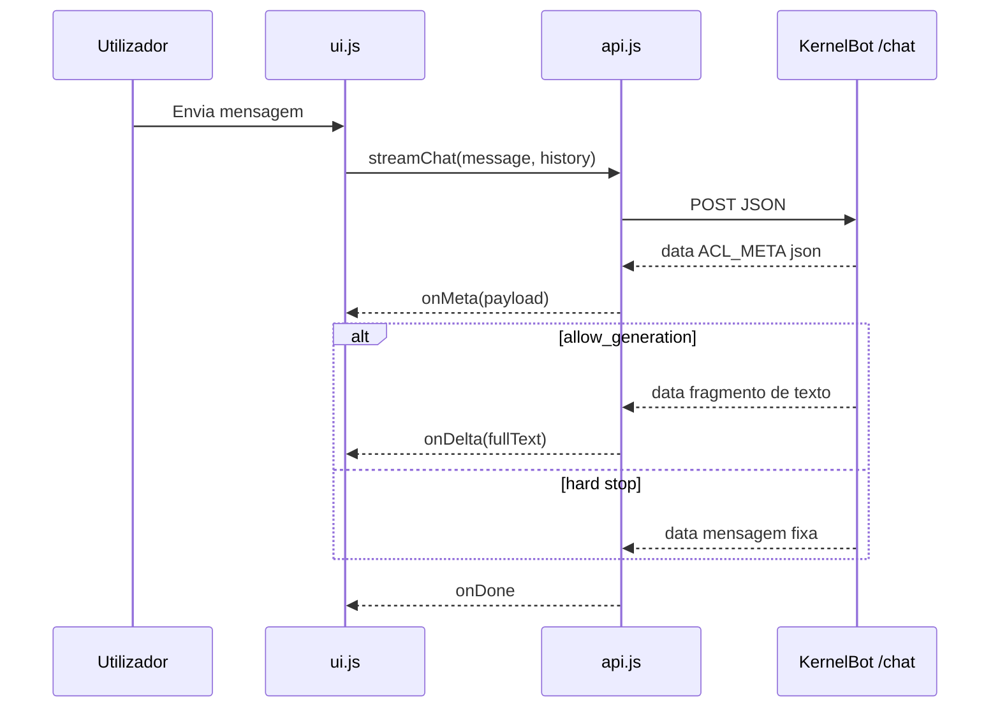

# Frontend e UI

[← Índice](README.md)

## Stack UI

| Peça | Localização |
|------|-------------|
| Template | `templates/index.html` |
| Lógica | `frontend/src/ui.js`, `main.js` |
| API SSE | `frontend/src/api.js` |
| Histórico + sessão | `frontend/src/utils/history.js`, `sessionId.js` |
| Estilos | `frontend/assets/css/theme.css` |

## Fluxo do chat (browser)

## Contrato UI ↔ `ACL_META` (v=3)

Campo canónico: **`allow_generation`** (boolean). O frontend também aceita fallback legado: `decision === "answer"` ⇒ geração permitida.

| `reason` | `allow_generation` | `decision` | UI |
|----------|-------------------|------------|-----|
| `ok` | `true` | `answer` | Stream markdown + breadcrumbs de fontes |
| `ambiguous_retrieval` | `true` | `answer` | Stream markdown **sem** XML cru; `DisambiguationChips` quando há `<ambiguity_options>` ou `disambiguation_options` no meta/texto |
| `ambiguous_retrieval` | `false` | `hard_stop` | `DisambiguationChips` ou texto fixo; `onDelta` ignorado |
| `post_generation_misalignment` | `false` | `hard_stop` (override) | Badge **misalignment** substitui hint de desambiguação; header `warning` |
| `index_gap` | `true` | `answer` | Badge advisory (sem bloquear LLM) |
| `provider_error` | `false` | `hard_stop` | Texto fixo streamed (sem LLM) |

Regras em `parseAclMeta.js` + `parseAmbiguityOptions.js`:

- **Hard stop** (ex.: `provider_error`, `allow_generation=false`): excepção; gates de retrieval não bloqueiam stream LLM.
- **Desambiguação com geração** (`ambiguous_retrieval` + `allow_generation=true`): o modelo deve emitir `<ambiguity_options>…</ambiguity_options>` (ver `grounding_disambiguation.txt`). O frontend remove o XML do markdown e monta os mesmos `DisambiguationChips`. O backend pode reforçar com `ACL_META` contendo `disambiguation_options` e `payload.suggested_candidates`.

### Flags de override pós-geração (reactividade)

| Campo `ACL_META` | Quando | Efeito na UI |
|------------------|--------|----------------|
| `post_generation_override: true` | `ACL_GROUNDING_POLICY=strict` | Hint `misalignment` + header “Revisão”; disclaimer no fim do stream |
| `post_generation_advisory: true` | `anchored` / `hybrid` | Hint `advisory` amarelo suave — resposta **mantida** |
| `grounding_policy` | Sempre que disponível | Badge “Modo didático” / “Modo rigoroso” |
| `pin_chunks_used: true` | Pin merge activo | Badge input «Continuando: {name}» |
| `scope_hint` | Pin vs disciplina da pergunta | Hint `--scope` no header |
| `sources_note` | Fontes do turno ≠ só pin | Nota no rodapé (`.message-sources-note`) |
| `allow_generation: false` | Após override | Impede tratar o turno como «sucesso» de desambiguação |

Com `ACL_GROUNDING_POLICY=anchored`, o segundo `ACL_META` pós-stream pode ser **advisory** (hint suave) em vez de override destrutivo.

### Breadcrumbs e badges de contexto

- `formatSource.js` — `db:discipline/slug` → rótulo legível
- `reasonLabel.js` — badge quando `reason` ≠ `ok`
- Badge “Complemento pedagógico” se o texto final contém *Extensão pedagógica*

### Smoke manual (browser)

1. `ACL_DISAMBIGUATION_ENABLED=false` — pergunta ambígua com 2+ hits próximos → chips ou mensagem fixa.
2. `ACL_DISAMBIGUATION_ENABLED=true` — chips + hint cinza; XML não visível na bolha.
3. On-corpus com extensão pedagógica rotulada → **sem** override “Revisão” (default `anchored`).
4. `ACL_GROUNDING_POLICY=strict` + resposta genérica → override “Revisão” se flags dispararem.

## Componentes por `reason` (hard stop)

| Componente | Ficheiro | Quando |
|------------|----------|--------|
| `IndexGapAlert` | `components/IndexGapAlert.js` | `index_gap` + `allow_generation=false` |
| `DisambiguationChips` | `components/DisambiguationChips.js` | `ambiguous_retrieval` + `allow_generation=false` + `payload.suggested_candidates` |

## ACL meta no rodapé

A UI mostra (quando disponível no `[ACL_META]`):

- `confidence` (rótulo de confiança)
- `sources` (`db:discipline/slug`)
- `sources_note` (rodapé, quando fontes ≠ só pin)
- Aviso `post_generation_advisory` / `post_generation_override`

## Parse de ACL (`frontend/src/acl/parseAclMeta.js`)

| Função | Papel |
|--------|-------|
| `allowsGeneration` | Lê `allow_generation` ou infere de `decision` |
| `isStructuredHardStop` | `index_gap` / `ambiguous_retrieval` sem geração |
| `shouldMountDisambiguationChips` | Chips bloqueantes |
| `isDisambiguationGeneration` | Hint `disambiguation` no stream |
| `isPostGenerationOverride` | Hint `misalignment` + header warning |
| `parseAmbiguityOptions.js` | Strip XML/JSON do texto; extrai candidatos para chips |

## Histórico de conversa (browser)

| Aspecto | Implementação |
|---------|---------------|
| Storage | `localStorage` chave `acl_conversation_v1` |
| Estrutura | `{ session_id, turns: [{ role, text, sources?, ts }] }` |
| Envio API | `getHistoryForApi()` → até `MAX_API_MESSAGES` (12) turnos como `{ role, content }` |
| Limites UI | `MAX_TURNS=30`, `MAX_CHARS=200_000` (truncagem ao gravar) |
| Migração | `sessionStorage` legado (`acl_history`, `acl_session_id`) → `localStorage` |
| Nova conversa | Botão no header → `clearConversation()` + novo `session_id` + `POST /reset` |
| `/reset` | Limpa pin servidor; **não** apaga histórico visual sozinho |

Persistência sobrevive refresh e fechar aba (mesma origem). Sem autenticação — POC local.

Detalhe API: [07-apis-e-sse.md](07-apis-e-sse.md) · FAQ: [19-faq-usuario.md](19-faq-usuario.md).

## Sessão e pin (servidor)

| Aspecto | Implementação |
|---------|---------------|
| ID | UUID em `localStorage` (via `history.js` / `sessionId.js`) |
| Pin | Servidor-side `PinnedSessionStore` por `session_id` |
| TTL pin | `ACL_PINNED_MAX_TURNS` (default 5) — decrementado em `begin_turn()` |

## Markdown na resposta

Renderização client-side das mensagens do assistente (biblioteca conforme `ui.js`).

## Ver também

- [07-apis-e-sse.md](07-apis-e-sse.md)
- [06-gates-e-decisoes.md](06-gates-e-decisoes.md)
