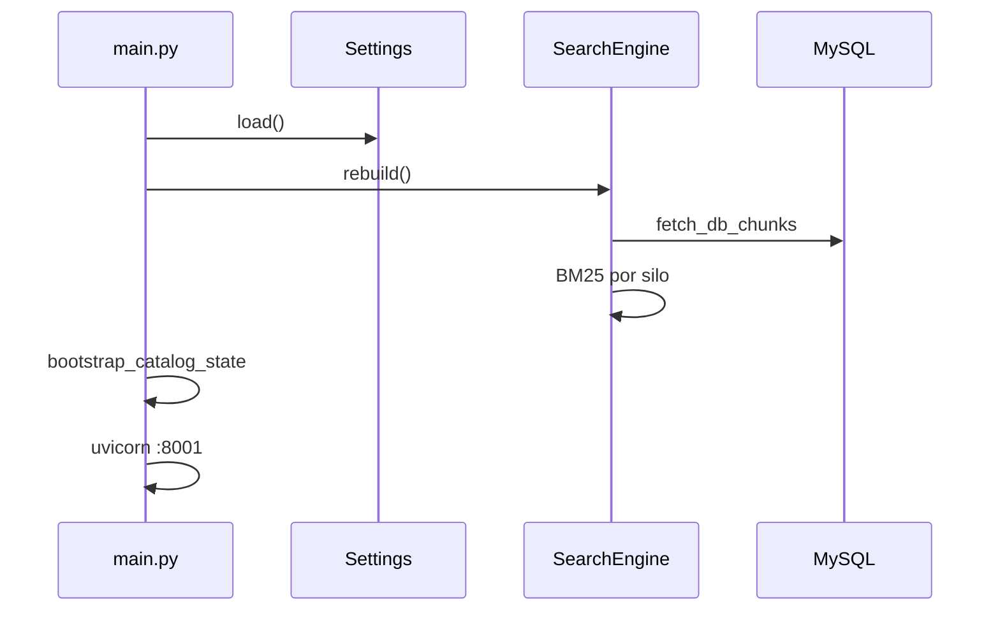

# Fluxos operacionais

[← Índice](README.md)

## 1. Boot do servidor



**Importante:** `rebuild()` corre no **import** de `main.py` — primeiro request já tem índice (se MySQL acessível).

## 2. Fluxo de chat (happy path)

1. UI `POST /chat` com `message` + `session_id`.
2. `ContextManager` resolve escopo (global, discipline, comandos).
3. `SearchEngine.search_candidates()`.
4. `build_decision()` → `ok`.
5. Monta mensagens (system + chunks + histórico + pin).
6. `ChatProvider` faz stream do LLM (Cursor SDK por default; OpenRouter se configurado).
7. `post_generation_flags()` — pode override (`strict`) ou advisory (`anchored`).
8. SSE completo → UI renderiza.

## 3. Fluxo hard stop

1. Passos 1–4 até `build_decision()`.
2. `allow_generation=false` (ex.: `provider_error`, override `strict`).
3. `hard_stop_message(reason)` — **sem** chamada ao LLM.
4. SSE com `[ACL_META]` + texto pedagógico.

## 4. Pin de contexto

| Evento | Acção |
|--------|-------|
| Decisão com chunks (RAG ou `/doc`) | `PinnedSessionStore.set_pinned()` após o turno |
| Turno seguinte (mesmo scope) | `_merge_pin_and_retrieval_chunks()` — pin primeiro, dedupe por `source`, `pinned_max_chars` |
| Sticky | `sticky_instruction.format(name=…)` injectado **antes** do grounding em `_assemble_system_content()` |
| Scope diferente | `_pin_conflicts` → `clear` pin |
| `/reset` | `clear` pin |
| TTL | `begin_turn()` decrementa `turns_left`; expira → pin removido |
| Meta SSE | `pinned_active`, `pinned_display`, `pin_chunks_used` (UI: “Continuando: {name}”) |

## 5. Reload de índice

| Origem | Mecanismo |
|--------|-----------|
| Manual | `POST /chat` com `message: "/reload"` + `Authorization: Bearer` |
| CI ISS | Workflow `sync-kernelbot-knowledge` (verify + `/reload`) após ingest |
| Restart processo | `rebuild()` no boot (import de `main.py`) |

**Não há** reload automático por filesystem (`watcher.py` inactivo).

## 6. Pipeline ISS → KernelBot (produção)

```text
Push ISS (content/ + jsons/)
  → GHA sync-kernelbot-knowledge.yml
    → Job 1 validate catalog
    → Job 2 ingest-knowledge.py → MySQL UPSERT
    → Job 3 verify + POST /reload
  → KernelBot índice RAM actualizado
```

Detalhe: [10-integracao-iss-fase5b.md](10-integracao-iss-fase5b.md).

## 7. Staging local (resumo)

```text
staging-setup.sh → staging-serve.sh → browser :8001
```

Detalhe: [13-staging-testes.md](13-staging-testes.md).

## Ver também

- [02-arquitetura.md](02-arquitetura.md)
