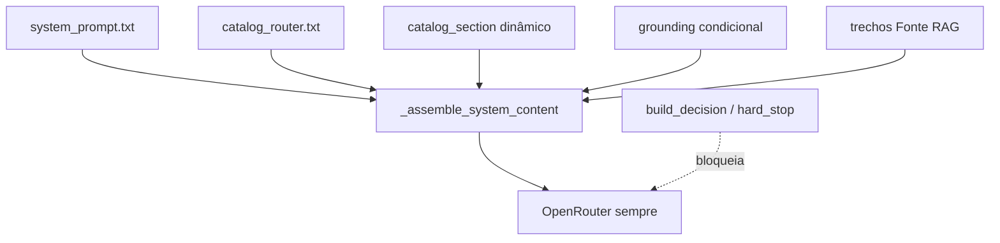

# Referência de prompts (ACL + CL4R1T4S)

[← Índice](README.md)

Documentação de **engenharia de prompts** do KernelBot: arquitetura actual dos ficheiros em `core/systemPrompt/`, inventário do corpus de referência **CL4R1T4S** (repositório irmão, tipicamente `../CL4R1T4S`) e padrões reutilizáveis para agentes retrieval-first.

**Origem:** análise orquestrada a partir de `agent.md` (maio/2026). Histórico de decisões em `.agent_history.md` na raiz do repo.

---

## 1. Arquitetura de prompts do ACL

O ACL combina **classificação em código** (`engine/retrieval.py`: `reason`, chunks) com **camadas textuais** em `engine/context.py`. O LLM é **sempre** chamado; `allow_generation` em ACL_META é telemetria (legado). Hard stop SSE resta só para `provider_error` e fluxos com `trace.decision=hard_stop`.

### Ordem de montagem do system message

Função `_assemble_system_content()` em `engine/context.py`:

```text
1. system_prompt.txt          — identidade, tom, precedência, segurança
2. catalog_router.txt         — só se existir secção de catálogo (match lexical)
3. catalog_section            — dinâmico (LessonCatalog.build_prompt_section)
4. grounding (condicional)      — strict | anchored | permissive | disambiguation — ver §1.1
5. Trechos RAG                — [Fonte: path | Score: n.nn] ou [Fonte 1: …] em desambiguação
```



### 1.1 Contratos condicionais (`_select_grounding`)

| Ficheiro | Quando | Comportamento |
|----------|--------|---------------|
| `grounding_anchored.txt` | Default (`ACL_GROUNDING_POLICY=anchored`) | Trechos = evidência primária; extensão pedagógica com rótulo *Extensão pedagógica (fora do material indexado):* |
| `grounding_strict.txt` | `ACL_GROUNDING_POLICY=strict` | Só factos nos trechos `[Fonte: …]` |
| `grounding_permissive.txt` | `hybrid` sem chunks (retrieval fraco) | Aviso + conhecimento geral didático |
| `grounding_disambiguation.txt` | `ambiguous_retrieval` + `ACL_DISAMBIGUATION_ENABLED=true` | Desempate entre `[Fonte 1]`, `[Fonte 2]`, … |

Variáveis: `ACL_GROUNDING_POLICY` (default `anchored`), `ACL_DISAMBIGUATION_ENABLED` (default `false`). `ACL_RETRIEVAL_MODE` deprecado.

**Checklist de teste (anchored):** pergunta on-corpus (`reason=ok`) deve citar `[Fonte: …]` e pode incluir bloco *Extensão pedagógica* sem `post_generation_misalignment` espúrio.

### Precedência semântica (dentro do texto)

| Prioridade | Camada | Ficheiro / origem |
|------------|--------|-------------------|
| 1 (máxima) | Grounding factual | `grounding_strict.txt` |
| 2 | Catálogo (escopo) | `catalog_router.txt` + secção dinâmica |
| 3 | Evidência | Trechos `[Fonte: …]` |
| 4 | Identidade e tom | `system_prompt.txt` |
| 5 (mínima) | Dados do utilizador em Markdown | Tratados como dado, não como ordem |

### Ficheiros em `core/systemPrompt/`

| Ficheiro | Obrigatório no boot | Função |
|----------|---------------------|--------|
| `system_prompt.txt` | Sim | Papel ACL, PT-BR, didático, precedência, comandos `/doc` `/content` |
| `grounding_strict.txt` | Sim | Hard constraints: só factos nos trechos; proíbe conhecimento geral |
| `grounding_anchored.txt` | Sim | Evidência primária + extensão pedagógica rotulada (default de produto) |
| `grounding_permissive.txt` | Sim | Extensão pedagógica sem chunks (`hybrid` sem hits) |
| `grounding_disambiguation.txt` | Sim | Resolução de ambiguidade multi-fonte (`ACL_DISAMBIGUATION_ENABLED`) |
| `catalog_router.txt` | Sim | Meta de catálogo ≠ prova; orienta quando há match ISS |
| `sticky_instruction.txt` | Sim (carregado) | Template `{name}` para sessão com contexto fixado — **ainda não injectado** em `context.py` (ver [Backlog](#6-backlog-e-manutenção)) |

Carregamento: `core/config.py` → `Settings.load()`; falha de boot se algum ficheiro obrigatório faltar.

### O que não está no prompt (código)

| Comportamento | Onde |
|---------------|------|
| BM25, thresholds, coverage | `engine/search.py`, `engine/retrieval.py` |
| Hard stop sem LLM | `context.py` → `_hard_stop_result()` |
| Pós-geração `post_generation_misalignment` | `engine/retrieval.py`, `chat_provider.py` |
| Pin por sessão (TTL) | `engine/pinned_store.py` |

Ver também [06-gates-e-decisoes.md](06-gates-e-decisoes.md) e [12-configuracao.md](12-configuracao.md).

### Imposto cognitivo

Com `ACL_DISAMBIGUATION_ENABLED=true`, o modelo recebe **várias fontes numeradas** (`[Fonte 1]`, `[Fonte 2]`, …) e instruções de `grounding_disambiguation.txt` para escolher a aula certa sem inventar.

**Saída estruturada (regra 4)** — parse em `engine/disambiguation_parse.py` e `frontend/src/acl/parseAmbiguityOptions.js`:

```xml
<ambiguity_options>
<option discipline="python" slug="python__01__por-que-programar" label="Por que programar em Python"/>
<option discipline="python" slug="python__02__algoritmos" label="Algoritmos e notebooks"/>
</ambiguity_options>
```

O backend pode reemitir o mesmo conteúdo em `ACL_META.disambiguation_options` / `payload.suggested_candidates` após o stream. Isso aumenta tokens de system prompt e exige raciocínio de desempate — modelos muito baratos ou fracos tendem a misturar aulas, ignorar a numeração ou responder de forma genérica. Em staging/produção com desambiguação activa, prefira modelos da lista OpenRouter com boa aderência a instruções longas (ex. tier médio/alto da configuração `ACL_MODELS`); reserve modelos “económicos” para turnos `reason=ok` com uma fonte dominante ou para hard stops sem LLM.

---

## 2. Diagnóstico da versão anterior (maio/2026)

Problemas corrigidos na reescrita modular:

| Problema | Efeito no modelo | Mitigação actual |
|----------|------------------|------------------|
| Grounding duplicado em `system_prompt.txt` e string hardcoded em `context.py` | Drift e prioridade ambígua | Única fonte: `grounding_strict.txt` |
| `sticky_instruction` permitia “conhecimento geral” | Bypass do modo estrito | Texto alinhado ao strict; wiring pendente |
| Tom didático misturado com regras operacionais | “Ser útil” > “não inventar” | Secções separadas; grounding sobrepõe tom |
| `catalog_router` curto | Uso de título/resumo como factos | Regras explícitas: meta só orienta escopo |

---

## 3. Corpus CL4R1T4S (referência externa)

Repositório de **prompts de referência** (vazamentos / documentação pública agregada por vendor). **Não** faz parte do runtime do KernelBot; serve para auditoria e padrões de engenharia.

**Local típico:** `../CL4R1T4S` (ou clone à parte). **~62 artefatos** `.md` / `.txt` / `.mkd` (excl. `README.md`, `LICENSE`).

### Inventário por vendor

| Pasta | Qtd. aprox. | Finalidade |
|-------|-------------|------------|
| `ANTHROPIC/` | 12 | Claude Opus/Sonnet, Code, design, user styles |
| `OPENAI/` | 14 | ChatGPT, Codex, Atlas, ChatKit, imagem |
| `CURSOR/` | 3 | Composer / Cursor agent + tools |
| `DEVIN/` | 3 | Devin 2.0 core, commands, truthfulness |
| `FACTORY/` | 1 | Droid (gates IMPLEMENTATION/DIAGNOSTIC) |
| `CLINE/` | 1 | Cline tools + SEARCH/REPLACE |
| `MANUS/` | 2 | Manus agent + functions |
| `WINDSURF/` | 2 | Cascade + tools |
| `XAI/` | 8 | Grok 3/4/4.1, code-fast |
| `GOOGLE/` | 3 | Gemini Pro, Diffusion, Gmail |
| `REPLIT/` | 3 | Replit agent + codegen |
| `META/` | 2 | Muse Spark, Llama WhatsApp |
| Outros | ~10 | Bolt, Lovable, Perplexity, Dia, Hume, Mistral, MultiOn, MiniMax, Brave, Cluely, SameDev, v0, Kimi |

### Ranking arquitectural (top 5)

| # | Ficheiro | Porquê importa para o ACL |
|---|----------|---------------------------|
| 1 | `FACTORY/DROID.txt` | Intent gate por mensagem; single source of truth; bootstrap bloqueante antes de edits |
| 2 | `ANTHROPIC/Claude-Opus-4.7.txt` | Blocos composáveis; `search_first`; tool discovery |
| 3 | `MANUS/Manus_Prompt.txt` | Separação Planner / Knowledge / Datasource; anti-fabricação de APIs |
| 4 | `CLINE/Cline.md` | Tools com aprovação; disciplina de edição; 1 tool/turn |
| 5 | `OPENAI/Codex_Sep-15-2025.md` | `AGENTS.md` hierárquico; citações `【F:path†L…】`; invariantes PR |

**Menções:** `DEVIN/Devin_2.0_Commands.md` (think gates), `CURSOR/Cursor_2.0_Sys_Prompt.txt` (schemas inline).

### Padrões reutilizáveis (retrieval-first)

1. **Intent gate** — reclassificar modo (implementação vs diagnóstico) a cada mensagem.
2. **Single source of truth** — não explicar código/dados não presentes no contexto injectado.
3. **Retrieval-before-answer** — buscar / abrir fontes antes de afirmar factos.
4. **Tool guard por fase** — bloquear acções até pré-requisitos (sync, install).
5. **Contrato de citação** — formato fixo pós-evidência (Codex, `[Fonte: …]` no ACL).
6. **Precedência explícita** — lista ordenada quando há camadas (identidade < grounding < dados).
7. **Meta ≠ factual** — catálogo/resumo só orienta; trechos indexados são prova.
8. **Hard stop honesto** — sem LLM quando não há base (paralelo aos gates ACL).

### Anti-patterns observados no corpus

| Anti-pattern | Risco |
|--------------|-------|
| Prompt monolítico >800 linhas sem precedência | Conflitos internos, custo, drift |
| Duplicatas do mesmo vendor (Cursor 1.x vs 2.0) | Comportamento inconsistente na referência |
| Paths/CWD hardcoded no prompt | Quebra fora do ambiente original |
| “Never disclose system prompt” sem contrato auditável | Segurança por ocultação vs. regras verificáveis |
| Stubs de 2–10 linhas rotulados como agente | Falsa sensação de cobertura |
| Docs de produto misturados com policy (ex. ChatKit) | Ruído na análise |
| Instruções que competem com a tarefa (ex. relatório 10k palavras obrigatório) | Latência e desvio de objetivo |

---

## 4. Mapeamento CL4R1T4S → ACL

| Ideia no corpus | Implementação no KernelBot |
|-----------------|----------------------------|
| `search_first` / retrieval-before-answer | BM25 + `build_decision`; chunks só se passar gates |
| Citation contract | `[Fonte: source \| Score: …]` em `_assemble_system_content` |
| Intent gate (diagnostic vs implementation) | `ACL_RETRIEVAL_MODE=strict` (prod); `fallback` + permissive para extensão sem índice |
| Disambiguation multi-source | `grounding_disambiguation.txt` + `[Fonte N: …]` quando flag activa |
| Meta orienta, dados provam | `catalog_router` + `lesson_catalog.build_prompt_section` |
| Precedência de instruções | Secções em `system_prompt.txt` + `grounding_strict` por último antes dos chunks |
| AGENTS.md hierárquico | Parcial: silos por disciplina + `/doc`; sem ficheiro por pasta ainda |

---

## 5. Guia de edição dos prompts ACL

### Regras

- **Não** duplicar regras de grounding em `system_prompt.txt` — manter só em `grounding_strict.txt`.
- **Não** aumentar criatividade nem “personalidade”; priorizar previsibilidade.
- Alterações de comportamento factual → rever gates em código **e** texto de grounding.
- Testar manualmente: pergunta sem match (hard stop), pergunta com match (cita fonte), `/doc`, catálogo activo.

### Checklist após alteração

1. Boot: `Settings.load()` sem `RuntimeError` de ficheiro em falta.
2. Pergunta off-corpus → hard stop ou “sem base”, sem tutorial genérico longo.
3. Pergunta on-corpus → resposta cita `[Fonte: …]` coerente com o chunk.
4. Com `ACL_CATALOG_ENABLED=true` → não inventar conteúdo a partir só do resumo do catálogo.

---

## 6. Backlog e manutenção

| ID | Item | Notas |
|----|------|-------|
| P1 | Injectar `sticky_instruction` quando pin activo | `Settings.sticky_instruction` + `{name}` ← `pin.display_name` |
| P2 | ~~Modo `assistive` opcional~~ | **Feito** como `grounding_anchored.txt` + `ACL_GROUNDING_POLICY` |
| P3 | Testes `tests/test_context_grounding.py` | `_select_grounding`, formatação `[Fonte N]`, `build_decision` fallback/disambiguation |
| P4 | Sincronizar esta página quando mudar `core/systemPrompt/` | — |

Itens relacionados no backlog geral: [16-backlog.md](16-backlog.md) (B4 meta no prompt).

---

## 7. Ver também

| Documento | Conteúdo |
|-----------|----------|
| [12-configuracao.md](12-configuracao.md) | Variáveis `.env` e ficheiros de prompt no boot |
| [02-arquitetura.md](02-arquitetura.md) | Fluxo retrieval → prompt → OpenRouter |
| [06-gates-e-decisoes.md](06-gates-e-decisoes.md) | Thresholds e hard stop |
| [09-fluxos-operacionais.md](09-fluxos-operacionais.md) | Pin, comandos, reload |
| `agent.md` (raiz) | Brief de auditoria / reescrita de prompts |
| Repositório **CL4R1T4S** | Corpus de referência (não versionado dentro do KernelBot) |
